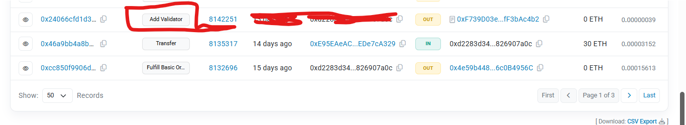

# AZTEC-SEQUENCER NODE
Aztec is a L2 protcol on Ethereum that provides privacy and enable private transanction onchain.
Details Guide on how to  Run `Sequencer Node` on Aztec Network Testnet, Earn `Apprentice` Role on discord and Produce blocks on the network.

* **What does sequencer nodes does  in the testnet?**
  * `Sequencer Nodes` proposes blocks, validates blocks from others, and votes on upgrades.
 

## Roles Info

## Hardware Requirements
* **Sequencer Node**: Minimum of 8 cores CPU, 16GB RAM, 100GB+ SSD (Most Vps will return 132 error, best exprience is gotten from Baremetal servers)

---

**Windows Users** 
For windows 10+ and above, Open your cmd and type `wsl.exe` , it should take you to your window subsytem where the commands below will work fine or just download ubuntu if you don't have wsl ready.

## 1. Install Dependecies
* Update packages:
```bash
sudo apt-get update && sudo apt-get upgrade -y
```

* Install Packages:
```bash
sudo apt install curl iptables build-essential git wget lz4 jq make gcc nano automake autoconf tmux htop nvme-cli libgbm1 pkg-config libssl-dev libleveldb-dev tar clang bsdmainutils ncdu unzip libleveldb-dev  -y
```

* Install Docker:
```bash
sudo apt update -y && sudo apt upgrade -y
for pkg in docker.io docker-doc docker-compose podman-docker containerd runc; do sudo apt-get remove $pkg; done

sudo apt-get update
sudo apt-get install ca-certificates curl gnupg
sudo install -m 0755 -d /etc/apt/keyrings
curl -fsSL https://download.docker.com/linux/ubuntu/gpg | sudo gpg --dearmor -o /etc/apt/keyrings/docker.gpg
sudo chmod a+r /etc/apt/keyrings/docker.gpg

echo \
  "deb [arch="$(dpkg --print-architecture)" signed-by=/etc/apt/keyrings/docker.gpg] https://download.docker.com/linux/ubuntu \
  "$(. /etc/os-release && echo "$VERSION_CODENAME")" stable" | \
  sudo tee /etc/apt/sources.list.d/docker.list > /dev/null

sudo apt update -y && sudo apt upgrade -y

sudo apt-get install docker-ce docker-ce-cli containerd.io docker-buildx-plugin docker-compose-plugin

# Test Docker
sudo docker run hello-world

sudo systemctl enable docker
sudo systemctl restart docker
```

## 2. Install Aztec Tools
```bash
bash -i <(curl -s https://install.aztec.network)
```
* **Restart your Terminal** now to apply changes.
* Check if you installed successfully:
```bash
aztec
```

## 3. Update Aztec to the latest version
```bash
aztec-up 0.85.0-alpha-testnet.5
```

## 4. Obtain RPC URLs

*  You can create a Sepolia `RPC URL` in [Alchemy](https://dashboard.alchemy.com/) and Use this `https://rpc.drpc.org/eth/sepolia/beacon` as free `BEACON RPC`. (You can run your own prysm, lighthouse nodes to get your own `BEACON RPC` or find other 3rd party solutions)

## 5. Generate Ethereum Keys (You can use your metamask to create a new wallet and use here)
Get an EVM Wallet with `Private Key` and `Public Address` saved.

## 6. Get Sepolia ETH
Fund your Ethereum Wallet with `ETH Sepolia`
you can get sepolia eth from alchemy `https://www.alchemy.com/faucets/ethereum-sepolia`

## 7. Find IP
```bash
curl ipv4.icanhazip.com
```
* Save it somewhere, you will need it later 

## 8. Enable Firewall & Open Ports
```console
# Firewall
ufw allow 22
ufw allow ssh
ufw enable

# Sequencer
ufw allow 40400
ufw allow 40500
ufw allow 8080
```

## 9. Sequencer Node
* Open screen or use Tmux
```bash
screen -S aztec
```

* Start the Node
```
aztec start --node --archiver --sequencer \
  --network alpha-testnet \
  --l1-rpc-urls RPC_URL  \
  --l1-consensus-host-urls BEACON_URL \
  --sequencer.validatorPrivateKey 0xYourPrivateKey \
  --sequencer.coinbase 0xYourAddress \
  --p2p.p2pIp IP
```
Replace the following variables before you Run Node:
* `RPC_URL` & `BEACON_URL`: Step 4
* `0xYourPrivateKey`: Your EVM wallet private key
* `0xYourAddress`: Your EVM wallet public address
* `IP`: Your server IP (Step 7)

## 10. Sync Node
After entering the command, your node starts running, It takes a few hours for your node to get sync to the tip of the block and mostly depend on how powerful your device is.

## 11. Geting Apprentice Role on Aztec Discord
Go to the discord channel :https://discord.com/channels/1144692727120937080/1367196595866828982 . Get the below details before you use the commands

**Open a New terminal and run the below command without shutting your Node**
*Step 1: Get the latest proven block number:*
```bash
curl -s -X POST -H 'Content-Type: application/json' \
-d '{"jsonrpc":"2.0","method":"node_getL2Tips","params":[],"id":67}' \
http://localhost:8080 | jq -r ".result.proven.number"
```
* Save this block number for the next steps
* Example output: 23546
* replace `http://localhost:8080` with your server ip addr if you're running on one, retain 8080 for  port.

**Step 2: Generate your sync proof**
```bash
curl -s -X POST -H 'Content-Type: application/json' \
-d '{"jsonrpc":"2.0","method":"node_getArchiveSiblingPath","params":["BLOCK_NUMBER","BLOCK_NUMBER"],"id":67}' \
http://localhost:8080 | jq -r ".result"
```
* Replace 2x `BLOCK_NUMBER` with your number, the output from step1 above

**Step 3: Register with Discord**
* Type the following command in this Discord server: `/operator start`
* After typing the command, Discord will display option fields that look like this:
* `address`:            Your validator address (Ethereum Address)
* `block-number`:      Block number for verification (Block number from Step 1)
* `proof`:             Your sync proof (base64 string from Step 2)

* Once you paste the proof, ensure your cursor is out of the proof details before you click on send to avoid the send button adding a gap to the details which will invlidate your proof

* After submission, you'll get your `Apprentice` Role


## 12. Register Validator once your Node is sync to the tip
```bash
aztec add-l1-validator \
  --l1-rpc-urls RPC_URL \
  --private-key your-private-key \
  --attester your-validator-address \
  --proposer-eoa your-validator-address \
  --staking-asset-handler 0xF739D03e98e23A7B65940848aBA8921fF3bAc4b2 \
  --l1-chain-id 11155111
```
Replace `RPC_URL`, `your-validator-address` & 2x `your-validator-address`, then proceed

---

# You will get this:
 ```bash
Adding validator (xxxxxx83d3442508ad63f3afa7f4e874xxxx, xxxxxd3442508ad63f3afa7f4e874b78269xxxx [forwarder: 0x871e7294B54dA07cFd71A95b6e2E66d86BcE41f8]) to rollup 0x8D1cc702453fa889f137DBD5734CDb7Ee96B6Ba0
[06:34:36.706] INFO: cli Adding validator (xxxx3d3442508ad63f3afa7f4e874b7826xxxxx, xxxx3d3442508ad63f3afa7f4e874b782xxxx [forwarder: 0x871e7294B54dA07cFd71A95b6e2E66d86BcE41f8]) to rollup 0x8D1cc702453fa889f137DBD5734CDb7Ee96B6Ba0
Transaction hash: xxx066cfd1d3a0ec29adfe3fe4ac0b11fb91bfbe049f268179eb9xxxxx
[06:34:37.864] INFO: cli Transaction hash: xxxx66cfd1d3a0ec29adfe3fe4ac0b11fb91bfbe049f268179eb9ee9def27xxx
```

* check sepolia scan to see if the validators goes through
`https://sepolia.etherscan.io/`
 


# TROUBLESHOOTING:
* world_state error :can be solve by removing the world_state folder

* error registering  validator : is due to chain not sync to th current tip
  
* invalid blocknumber is caused from the public consesus address (BEACON ADDR), get a new one


# If there is need to update the Node
* Stop node with
```bash
  Ctrl+C
```
* update the node
```bash
aztec-up <new node version>
```
# If you need to delete the node 
* Stop node with Ctrl+C.
* Delete node data:
```bash
rm -r /root/.aztec
```
# If you need to restart the node 
* Re-run the node using start command.
* * Start the Node
```
aztec start --node --archiver --sequencer \
  --network alpha-testnet \
  --l1-rpc-urls RPC_URL  \
  --l1-consensus-host-urls BEACON_URL \
  --sequencer.validatorPrivateKey 0xYourPrivateKey \
  --sequencer.coinbase 0xYourAddress \
  --p2p.p2pIp IP
```

This Readme will keep getting update here and on my X https://x.com/HallenjayArt


